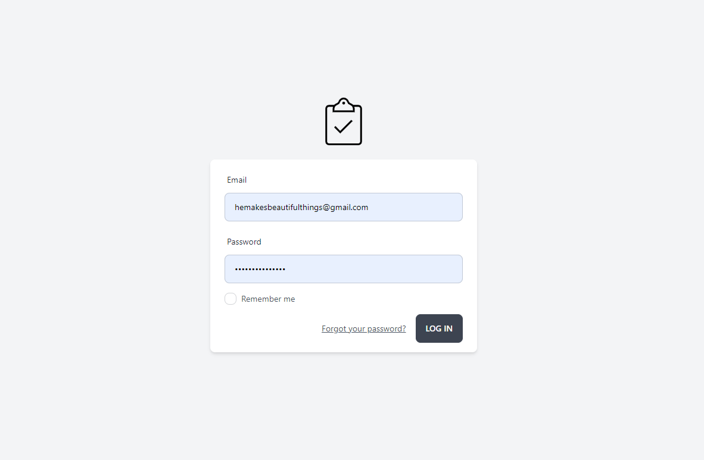
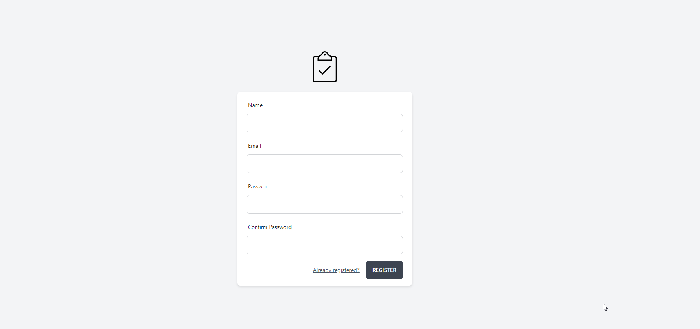
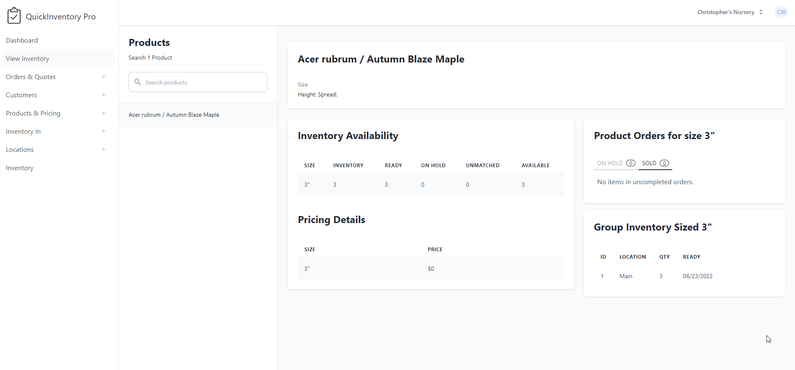

# This fork will integrate an API
   
   1. Determine the technology stack

   2.  Define the API endpoints: Define the endpoints that the API will expose. This includes the HTTP methods (GET, POST, PUT, DELETE) and the resource URLs. For example, if you want to add a new purchase, the endpoint might be /api/purchases/add.

   3. Choose a framework

   4. Implement the API endpoints

   5. Test the API
   6. Secure the API

   7. Document the API


# Aventory (Previously Awia for Nurseries)

Aventory is a web application that integrates with popular accounting platforms like QuickBooks Online and Xero. It makes the task of managing inventory on your nursery or other business simple and easy to approach.

## How to get on the Sponsor list
Make one significant contribution for free. That's it.

## Screenshots





## Frameworks used

- Laravel/PHP for the backend.
- VueJs/InertiaJS for the frontend.


## About Application

## Modules

- Nursery Management
- Customer Management
- Product Management
- Order Management
- Team Management
- Vendor Management
- Purchase Management
- Profile update, Password update, Account deletion
- Secure account with Two FA
- Browser session management

## Architecture

### Backend

- User Authentication : Laravel Jetstream + Laravel Sanctum package (Token based)
- User Permissions : Laravel Jetstream
- Session : Managed by Sanctum (Database based)
- Middleware : Sanctum auth
- Models : Default Laravel core Eloquent with relationship (ORM)
- Views : Loaded by Inertia (JSON based)

### Frontend

- VueJs : Component based (Client state management)
- InertiaJS : Bridge between server & client for single vue component
- Routing : Handled by InertiaJS
- Bundling : Webpack & Laravel Mix

## Installation

### Clone and Setup

To ensure your machine is ready for development, make sure that your machine is ready for Laravel development. 
This is not ready for public deployment. If you prefer to work on a virtual machine please made sure it has a desktop interface such as Xubuntu https://xubuntu.org/

This can easy be setup to remote in using X2Go which does not support the Gnome version used in Ubuntu. XFCE is a nice and light window manager for use on your server. You can open a web browser such as firefox in XCFE and view the application from http://localhost


**From the Laravel Docs:**
"Before creating your first Laravel project, you should ensure that your local machine has PHP and Composer installed. If you are developing on macOS (or WSL), PHP and Composer can be installed via Homebrew. In addition, we recommend installing Node and NPM."

#### **Setup Docker**
Follow the appropriate steps to install and configure Laravel with Docker on your machine.
**Docs on setting up Laravel & Docker:**
https://laravel.com/docs/9.x/installation#laravel-and-docker

#### **Windows Users:**

You must use WSL with Docker desktop. Ensure you clone the git repo into your linux filesystem.
https://laravel.com/docs/9.x/installation#getting-started-on-windows

Please note if you are a Windows user and require support please see the main project.
https://github.com/awia-co/

### Clone the Repository 

Ensure you clone the repository into your linux or macOS filesystem.

```bash
git clone https://github.com/awia-co/Aventory.git
```

### Install packages
Open terminal @ Awia-For-Nurseries folder

- [Configure a bash alias for sail](https://laravel.com/docs/9.x/sail#configuring-a-bash-alias) by running the following command in your linux terminal:

```bash
alias sail='[ -f sail ] && bash sail || bash vendor/bin/sail'
```

- Copy sample env `cp .env.example .env`
- Open .env file and update DB setting
- Ensure add a custome database name, username, and password. 
    These can be anything you like as Laravel sail will create the database for you.
- Install composer dependancies:
```bash
docker run --rm \
    -u "$(id -u):$(id -g)" \
    -v $(pwd):/var/www/html \
    -w /var/www/html \
    laravelsail/php81-composer:latest \
    composer install --ignore-platform-reqs
```


### Start the container:
```bash
sail up -d
```

### Start development:
- Generate App key : `sail artisan key:generate`
- Migrate all tables : `sail artisan migrate`


### Install vite:

```bash
apt-get install npm
npm install 
npm run dev
```

### Visit the application:
- Open your browser and navigate to http://localhost
- You should see the login page.
- Create an account by visiting http://localhost/register
- Login to your account by visiting http://localhost/login
- You should see the dashboard after logging in.


### Acessing pgweb
-Open your browser and nagivate to http://www.localhost:8081

## Autogenerate documentation

You can update model block docs by running the following command:

```shell
php artisan ide-helper:models
```

## Run the seed command to migrate data

In `.env` file, set up the configuration of MS SQL server from which data can be imported as shown below.

```
DB_SQLSRV_HOST=host.docker.internal
DB_SQLSRV_PORT=1433
DB_SQLSRV_DATABASE=TestDB
DB_SQLSRV_USERNAME=username
DB_SQLSRV_PASSWORD=password
```

Migrate your custom data by running the seed command and select the data to import as shown below.

```
sail artisan migrate:data

 Do you want to backup current DB? (yes/no) [yes]:
 > yes

The backup has been started
The backup has been proceed successfully. => app/backups/backup_20220808.sql

 Which customer data do you want to migrate? [GardenGateNursery]:
    [0] GardenGateNursery
 > 0
```

## Testing the application visually

In order to visually test the application, make sure that you have migrated the data with the above command and have followed all appropriate set up steps. 

Then, you will want to login with the credentials below:

Username: teststuff@gmail.com   
Password: password


## Technologies

- PostreSQL
- PHP
- Javascript
- HTML
- CSS
- TailwindCSS
- VueJS
- Laravel
- InertiaJS
- Vite

## License

We're using the apache 2.0 license. Full license details is in the [LICENSE](LICENSE.md) file.
